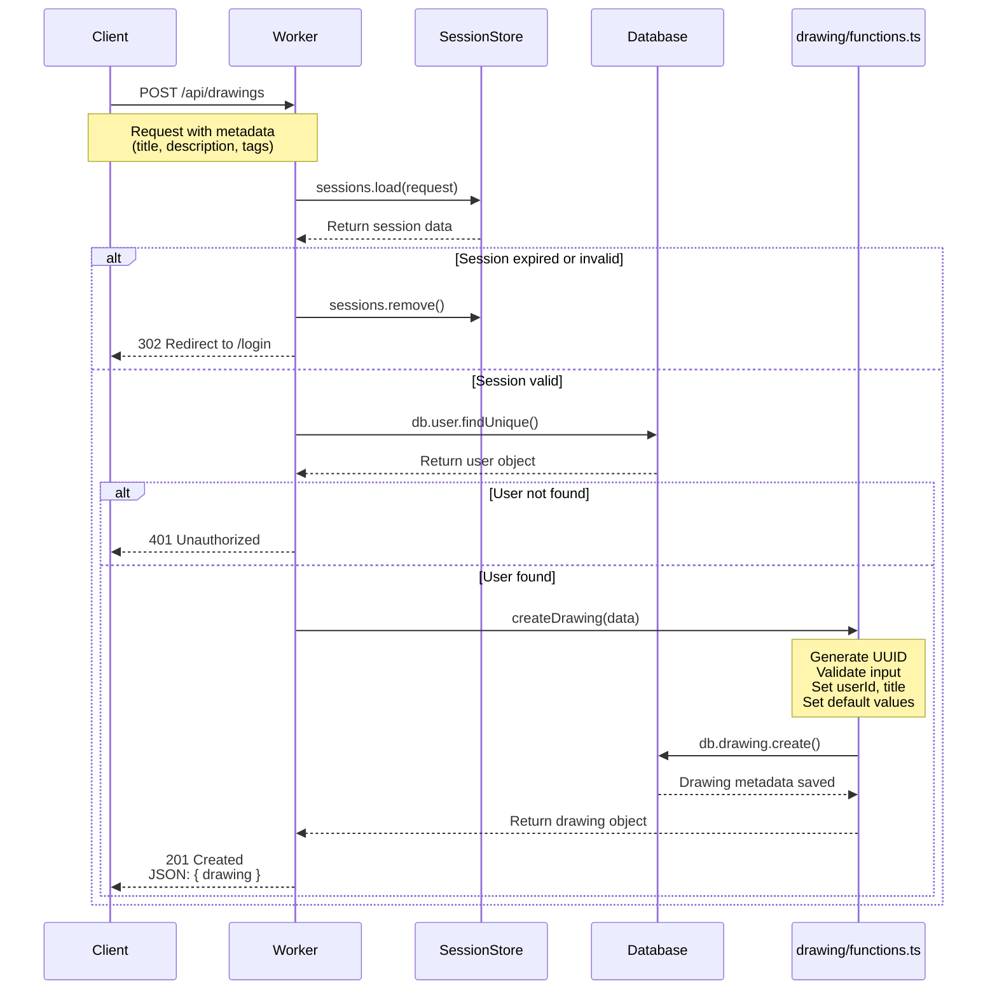
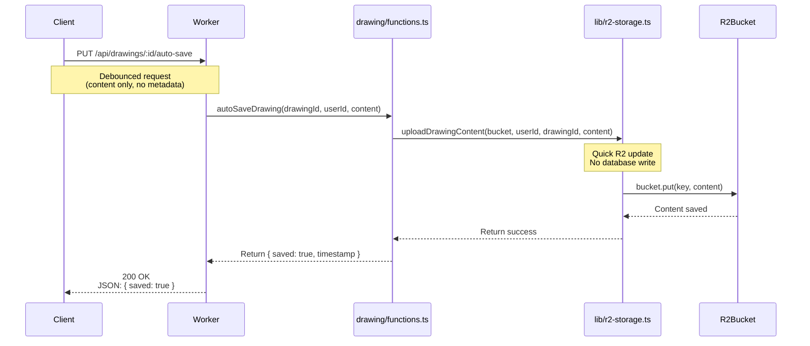
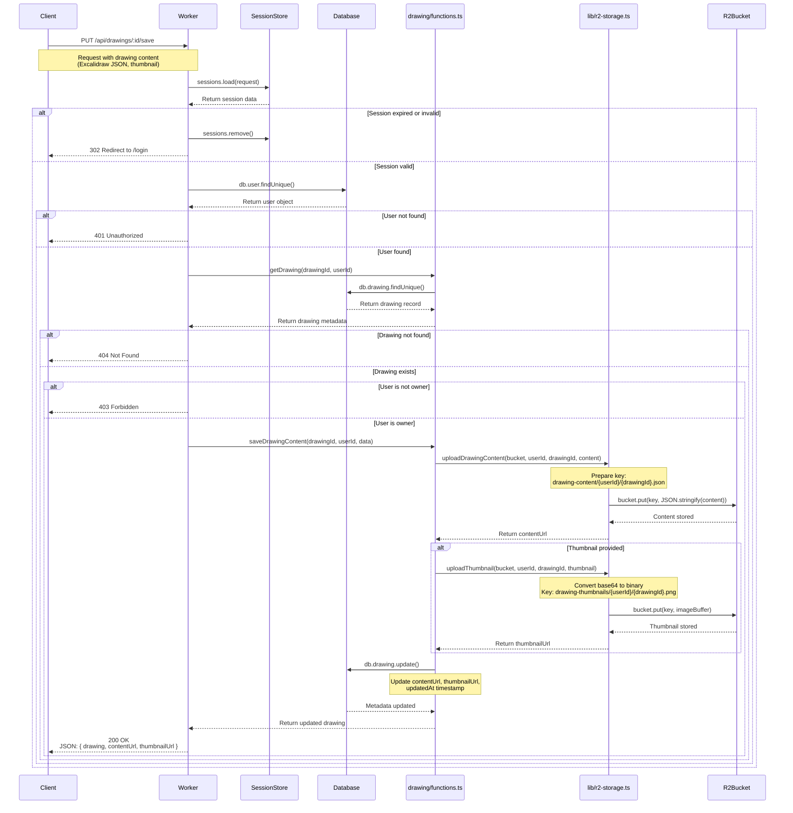
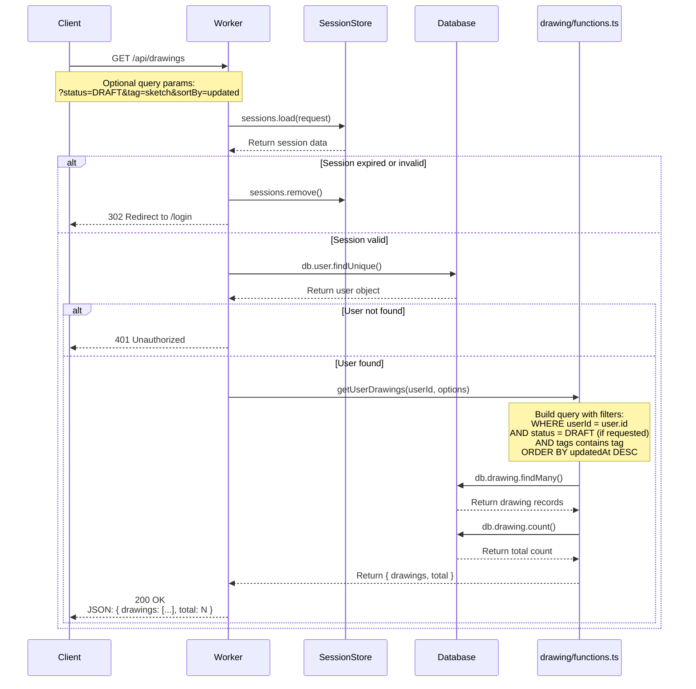
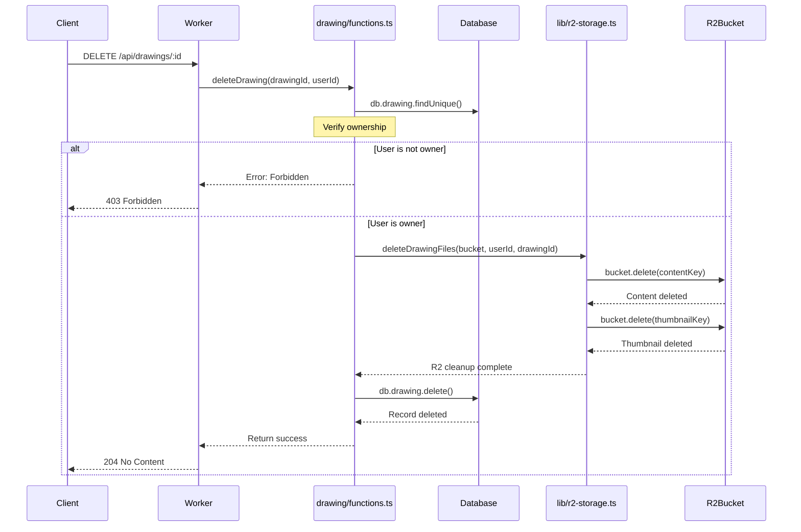
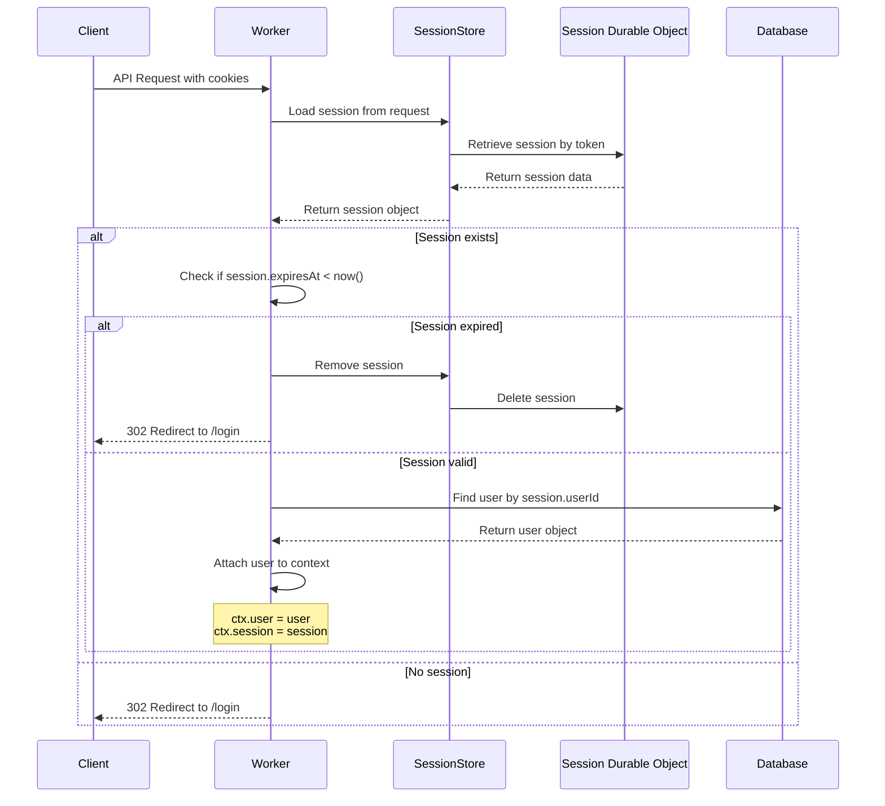

# Drawing API Backend Logic Documentation

This document outlines the backend logic for the drawing management APIs in the Excalidraw Redwood App.

## Overview

The application manages drawings through a **draft-first workflow** with status-based lifecycle management:

### Drawing Lifecycle States

```
DRAFT (Personal/Private)
  ↓ User publishes
PUBLISHED (Shareable)
  ↓ User archives
ARCHIVED (Hidden)
```

- **DRAFT**: Work in progress, private to user, supports auto-save
- **PUBLISHED**: Finalized drawing, can be converted to shareable with permissions
- **ARCHIVED**: Hidden but kept for reference

### Core API Operations

1. **Create Drawing** - Creates a new drawing (defaults to DRAFT status)
2. **Auto-Save Drawing** - Frequent background saves for drafts
3. **Save Drawing** - Manual save with full content to R2
4. **Get Drawing Content** - Load drawing from R2 for editing
5. **Update Drawing Metadata** - Update title, description, tags
6. **Publish Drawing** - Convert draft to published state
7. **Archive Drawing** - Move to archived state
8. **List Drawings** - Query drawings with status filters
9. **Duplicate Drawing** - Copy existing drawing
10. **Delete Drawing** - Permanently remove drawing

### Storage Architecture

Drawings follow a **hybrid storage approach**:

- **D1 Database (Metadata)**: Stores drawing metadata (ID, title, description, status, timestamps, user info) - Small data (<1KB per record)
- **R2 Storage (Content)**: Stores the actual Excalidraw drawing data (JSON), thumbnails, and version history - Large files (up to 10MB)

This separation optimizes:
- **Performance**: Fast metadata queries without loading large drawing files
- **Cost**: R2 is optimized for large file storage
- **Scalability**: Can handle thousands of drawings efficiently
- **Auto-save**: Quick R2 updates without database overhead

---

## 1. Create Drawing API

### Purpose
Creates a new drawing metadata record in the database with DRAFT status by default. This initializes a drawing without storing the actual content yet. The content is stored separately via the Save/Auto-Save APIs.

### Sequence Diagram



### Expected Request
```typescript
POST /api/drawings
Content-Type: application/json

{
  "title": "My Drawing",
  "description": "Optional description",
  "isPublic": false,
  "tags": ["sketch", "diagram"]
}
```

### Expected Response
```typescript
201 Created

{
  "drawing": {
    "id": "uuid-here",
    "userId": "user-uuid",
    "title": "My Drawing",
    "description": "Optional description",
    "contentUrl": null,  // No content stored yet
    "thumbnailUrl": null,  // No thumbnail yet
    "isPublic": false,
    "isArchived": false,
    "tags": ["sketch", "diagram"],
    "createdAt": "2025-10-01T10:00:00.000Z",
    "updatedAt": "2025-10-01T10:00:00.000Z",
    "lastOpenedAt": null
  }
}
```

### Notes
- This API only creates the metadata record
- Use the Save Drawing API (PUT /api/drawings/:id/save) to store actual content

### Drawing Data Model
Based on `src/types/drawing.ts`:
```typescript
interface Drawing {
  id: string              // UUID
  userId: string          // Foreign key to User
  title: string           // Drawing title
  description?: string | null
  contentUrl?: string | null  // R2 path to drawing JSON (not the full content)
  thumbnailUrl?: string | null // R2 path to thumbnail image
  status: DrawingStatus   // DRAFT | PUBLISHED | ARCHIVED
  isPublic: boolean       // Visibility flag (only for PUBLISHED)
  tags?: string[]         // Optional tags for organization
  createdAt: Date
  updatedAt: Date
  publishedAt?: Date | null  // When status changed to PUBLISHED
  lastOpenedAt?: Date | null
}

enum DrawingStatus {
  DRAFT = 'DRAFT',
  PUBLISHED = 'PUBLISHED',
  ARCHIVED = 'ARCHIVED'
}

// Note: The 'content' field is NOT stored in D1 database
// Content is stored in R2 and accessed via contentUrl
```

---

## 2. Auto-Save Drawing API

### Purpose
Lightweight auto-save endpoint for frequent background saves during editing. Only updates R2 content without modifying metadata. Designed for DRAFT drawings with debounced client-side calls (every 3-5 seconds).

### Sequence Diagram



### Expected Request
```typescript
PUT /api/drawings/:id/auto-save
Content-Type: application/json

{
  "content": {
    // Excalidraw JSON only
    "type": "excalidraw",
    "version": 2,
    "elements": [...],
    "appState": {...}
  }
}
```

### Expected Response
```typescript
200 OK

{
  "saved": true,
  "timestamp": "2025-10-01T10:15:30.000Z"
}
```

### Notes
- No session/auth check needed (faster)
- Only for DRAFT status drawings
- No thumbnail generation
- No metadata updates
- Optimized for speed (<100ms)

---

## 3. Save Drawing API

### Purpose
Full manual save that updates both R2 content and D1 metadata. Handles large Excalidraw JSON data, thumbnails, and metadata updates (title, description, etc.).

### Sequence Diagram



### Expected Request
```typescript
PUT /api/drawings/:id/save
Content-Type: application/json

{
  "content": {
    // Full Excalidraw JSON data
    "type": "excalidraw",
    "version": 2,
    "source": "...",
    "elements": [...],
    "appState": {...},
    "files": {...}
  },
  "thumbnail": "data:image/png;base64,...", // Optional base64 thumbnail
  "title": "Updated Title", // Optional - update title while saving
  "description": "Updated description" // Optional
}
```

### Expected Response
```typescript
200 OK

{
  "drawing": {
    "id": "uuid-here",
    "userId": "user-uuid",
    "title": "Updated Title",
    "description": "Updated description",
    "contentUrl": "drawing-content/user-uuid/uuid-here.json",
    "thumbnailUrl": "drawing-thumbnails/user-uuid/uuid-here.png",
    "isPublic": false,
    "isArchived": false,
    "tags": ["sketch", "diagram"],
    "createdAt": "2025-10-01T10:00:00.000Z",
    "updatedAt": "2025-10-01T10:15:30.000Z",
    "lastOpenedAt": null
  },
  "contentUrl": "https://r2-bucket.example.com/drawing-content/user-uuid/uuid-here.json",
  "thumbnailUrl": "https://r2-bucket.example.com/drawing-thumbnails/user-uuid/uuid-here.png"
}
```

### R2 Storage Structure

```
R2 Bucket: excalidraw-drawings
│
├── drawing-content/
│   └── {userId}/
│       ├── {drawingId-1}.json     // Excalidraw JSON data
│       ├── {drawingId-2}.json
│       └── ...
│
├── drawing-thumbnails/
│   └── {userId}/
│       ├── {drawingId-1}.png      // PNG thumbnail
│       ├── {drawingId-2}.png
│       └── ...
│
└── drawing-versions/               // Future: Version history
    └── {userId}/
        └── {drawingId}/
            ├── v1-{timestamp}.json
            ├── v2-{timestamp}.json
            └── ...
```

### Storage Best Practices

1. **Content Storage (R2)**:
   - Store as JSON with proper Content-Type
   - Use consistent naming: `{userId}/{drawingId}.json`
   - Enable R2 metadata for versioning info
   - Compress large files before upload

2. **Thumbnail Storage (R2)**:
   - Convert base64 to binary before storing
   - Use PNG format for quality
   - Recommended size: 400x300px
   - Set cache headers for CDN

3. **Auto-save Strategy**:
   - Debounce saves (e.g., every 5 seconds)
   - Track dirty state on client
   - Show "Saving..." indicator
   - Handle offline/online transitions

4. **Performance Optimization**:
   - Use R2 presigned URLs for direct uploads (future)
   - Implement client-side compression
   - Cache thumbnails aggressively
   - Lazy-load drawing content

---

## 4. Get Drawing Content API

### Purpose
Fetches the actual Excalidraw JSON content from R2 storage. Used when opening a drawing in the editor.

### Expected Request
```typescript
GET /api/drawings/:id/content
```

### Expected Response
```typescript
200 OK

{
  "content": {
    "type": "excalidraw",
    "version": 2,
    "source": "...",
    "elements": [...],
    "appState": {...},
    "files": {...}
  },
  "drawing": {
    "id": "uuid-here",
    "title": "My Drawing",
    "status": "DRAFT",
    "updatedAt": "2025-10-01T10:15:30.000Z"
  }
}
```

---

## 5. Update Drawing Metadata API

### Purpose
Updates only metadata fields (title, description, tags) without touching R2 content. Fast operation for renaming or organizing drawings.

### Expected Request
```typescript
PATCH /api/drawings/:id
Content-Type: application/json

{
  "title": "Updated Title",
  "description": "New description",
  "tags": ["updated", "tags"]
}
```

### Expected Response
```typescript
200 OK

{
  "drawing": {
    "id": "uuid-here",
    "title": "Updated Title",
    "description": "New description",
    "tags": ["updated", "tags"],
    "updatedAt": "2025-10-01T10:20:00.000Z"
  }
}
```

---

## 6. Publish Drawing API

### Purpose
Converts a DRAFT drawing to PUBLISHED status, making it ready for sharing (future feature).

### Expected Request
```typescript
PUT /api/drawings/:id/publish
```

### Expected Response
```typescript
200 OK

{
  "drawing": {
    "id": "uuid-here",
    "status": "PUBLISHED",
    "publishedAt": "2025-10-01T10:25:00.000Z",
    "updatedAt": "2025-10-01T10:25:00.000Z"
  }
}
```

### Notes
- Only DRAFT drawings can be published
- Sets `publishedAt` timestamp
- Future: Will enable sharing features

---

## 7. Archive Drawing API

### Purpose
Moves a drawing to ARCHIVED status, hiding it from default views but keeping it accessible.

### Expected Request
```typescript
PUT /api/drawings/:id/archive
```

### Expected Response
```typescript
200 OK

{
  "drawing": {
    "id": "uuid-here",
    "status": "ARCHIVED",
    "updatedAt": "2025-10-01T10:30:00.000Z"
  }
}
```

### Notes
- Can archive DRAFT or PUBLISHED drawings
- Archived drawings can be restored by updating status

---

## 8. List Drawings API

### Purpose
Retrieves all drawings belonging to the authenticated user with status-based filtering.

### Sequence Diagram



### Expected Request
```typescript
GET /api/drawings
// or with filters
GET /api/drawings?status=DRAFT&tag=sketch&sortBy=updated
GET /api/drawings?status=PUBLISHED
GET /api/drawings/drafts  // Shorthand for ?status=DRAFT
```

### Expected Response
```typescript
200 OK

{
  "drawings": [
    {
      "id": "uuid-1",
      "userId": "user-uuid",
      "title": "Drawing 1",
      "description": null,
      "contentUrl": "drawing-content/user-uuid/uuid-1.json",
      "thumbnailUrl": "drawing-thumbnails/user-uuid/uuid-1.png",
      "status": "DRAFT",
      "isPublic": false,
      "tags": ["sketch"],
      "createdAt": "2025-10-01T09:00:00.000Z",
      "updatedAt": "2025-10-01T09:30:00.000Z",
      "lastOpenedAt": "2025-10-01T09:30:00.000Z"
    },
    {
      "id": "uuid-2",
      "userId": "user-uuid",
      "title": "Drawing 2",
      "description": "My second drawing",
      "contentUrl": "drawing-content/user-uuid/uuid-2.json",
      "thumbnailUrl": null,  // No thumbnail generated yet
      "status": "PUBLISHED",
      "isPublic": true,
      "tags": ["diagram", "sketch"],
      "publishedAt": "2025-09-30T16:00:00.000Z",
      "createdAt": "2025-09-30T15:00:00.000Z",
      "updatedAt": "2025-10-01T08:00:00.000Z",
      "lastOpenedAt": null
    }
  ],
  "total": 2
}
```

### Notes
- This API returns only metadata, not the actual drawing content
- To load a drawing's content, fetch from R2 using the `contentUrl`
- Thumbnails can be loaded directly from `thumbnailUrl` for preview
- Supports status-based filtering for organizing drawings

---

## 9. Duplicate Drawing API

### Purpose
Creates a copy of an existing drawing with all content and metadata. New drawing starts as DRAFT.

### Expected Request
```typescript
POST /api/drawings/:id/duplicate
Content-Type: application/json

{
  "title": "Copy of Original Title"  // Optional, defaults to "Copy of {original}"
}
```

### Expected Response
```typescript
201 Created

{
  "drawing": {
    "id": "new-uuid-here",
    "userId": "user-uuid",
    "title": "Copy of Original Title",
    "description": "Same as original",
    "contentUrl": "drawing-content/user-uuid/new-uuid-here.json",
    "thumbnailUrl": "drawing-thumbnails/user-uuid/new-uuid-here.png",
    "status": "DRAFT",
    "isPublic": false,
    "tags": ["sketch"],
    "createdAt": "2025-10-01T11:00:00.000Z",
    "updatedAt": "2025-10-01T11:00:00.000Z"
  }
}
```

### Notes
- Copies both R2 content and metadata
- New drawing always starts as DRAFT
- New UUID generated for copy
- R2 files are duplicated

---

## 10. Delete Drawing API

### Purpose
Permanently deletes a drawing from both D1 database and R2 storage.

### Sequence Diagram



### Expected Request
```typescript
DELETE /api/drawings/:id
```

### Expected Response
```typescript
204 No Content
```

### Notes
- Permanently deletes from both D1 and R2
- Cannot be undone
- Verifies user ownership before deletion
- R2 cleanup happens before database deletion
- If R2 deletion fails, database record is kept

---

## Common Authentication Flow

Both APIs share the same authentication mechanism:



---

## Database Schema (Future Implementation)

**Note:** The Drawing table is not yet implemented in the Prisma schema. The expected schema follows the **hybrid storage approach**:

```prisma
model Drawing {
  id           String        @id @default(uuid())
  userId       String
  user         User          @relation(fields: [userId], references: [id], onDelete: Cascade)

  // Metadata only (stored in D1)
  title        String
  description  String?
  contentUrl   String?       // R2 path: drawing-content/{userId}/{drawingId}.json
  thumbnailUrl String?       // R2 path: drawing-thumbnails/{userId}/{drawingId}.png

  // Status and Settings
  status       DrawingStatus @default(DRAFT)
  isPublic     Boolean       @default(false)
  tags         String[]      // SQLite stores as comma-separated or JSON

  // Timestamps
  createdAt    DateTime      @default(now())
  updatedAt    DateTime      @updatedAt
  publishedAt  DateTime?     // Set when status changes to PUBLISHED
  lastOpenedAt DateTime?

  @@index([userId, status, updatedAt])
  @@index([userId, status])
  @@index([isPublic])
}

enum DrawingStatus {
  DRAFT
  PUBLISHED
  ARCHIVED
}

// Add to User model:
model User {
  // ... existing fields
  drawings Drawing[]
}
```

### Why Hybrid Storage?

**D1 Database** stores:
- Drawing metadata (title, description, settings)
- User references and permissions
- Timestamps for sorting and filtering
- URLs to R2 content

**R2 Storage** stores:
- Actual Excalidraw JSON (can be 1-10MB)
- Thumbnail images
- Future: Version history

**Benefits**:
1. **Fast Queries**: List drawings without loading large JSON
2. **Cost Effective**: R2 is cheaper for large files
3. **Scalability**: Can handle thousands of drawings efficiently
4. **Performance**: Metadata queries are <50ms

---

## Error Handling

### Common Error Responses

| Status Code | Scenario | Response |
|-------------|----------|----------|
| 302 | Session expired or invalid | Redirect to `/login` |
| 401 | Unauthorized (no valid user) | `{ "error": "Unauthorized" }` |
| 400 | Invalid request data | `{ "error": "Invalid request", "details": "..." }` |
| 404 | Drawing not found (for individual ops) | `{ "error": "Drawing not found" }` |
| 500 | Internal server error | `{ "error": "Internal server error" }` |

---

## Implementation Status

- ✅ TypeScript interfaces defined (`src/types/drawing.ts`)
- ✅ UI component ready (`src/app/components/drawing/DrawingCard.tsx`)
- ❌ Database schema not yet added to Prisma
- ❌ API routes not yet implemented
- ❌ Backend functions not yet created
- ❌ R2 bucket not yet configured

## Next Steps

### 1. Setup R2 Storage
```bash
# Create R2 bucket via Cloudflare Dashboard or Wrangler
wrangler r2 bucket create excalidraw-drawings

# Add R2 binding to wrangler.toml
[[r2_buckets]]
binding = "DRAWINGS_BUCKET"
bucket_name = "excalidraw-drawings"
```

### 2. Update Database Schema
Add `Drawing` model to `prisma/schema.prisma` with hybrid storage fields:
```bash
npx prisma migrate dev --name add_drawing_model_with_r2
```

### 3. Create Backend Functions
Create `src/app/pages/drawing/functions.ts`:
- `createDrawing(data)` - Create metadata in D1 with DRAFT status
- `autoSaveDrawing(drawingId, userId, content)` - Quick R2 update only
- `saveDrawingContent(drawingId, userId, data)` - Save content to R2 + update metadata
- `getDrawing(drawingId, userId)` - Fetch metadata from D1
- `getDrawingContent(drawingId, userId)` - Fetch content from R2
- `getUserDrawings(userId, options)` - List metadata from D1 with status filters
- `updateDrawingMetadata(drawingId, userId, updates)` - Update title, description, tags
- `publishDrawing(drawingId, userId)` - Change status to PUBLISHED
- `archiveDrawing(drawingId, userId)` - Change status to ARCHIVED
- `duplicateDrawing(drawingId, userId, title?)` - Copy drawing with new UUID
- `deleteDrawing(drawingId, userId)` - Delete from both D1 and R2

### 4. Create API Routes
Create `src/app/pages/drawing/routes.ts`:
- POST `/api/drawings` - Create new drawing (DRAFT by default)
- PUT `/api/drawings/:id/auto-save` - Auto-save content only
- PUT `/api/drawings/:id/save` - Full save with metadata
- GET `/api/drawings/:id/content` - Get drawing content from R2
- PATCH `/api/drawings/:id` - Update metadata only
- PUT `/api/drawings/:id/publish` - Publish drawing
- PUT `/api/drawings/:id/archive` - Archive drawing
- GET `/api/drawings` - List all drawings with status filters
- GET `/api/drawings/drafts` - List drafts only (shorthand)
- POST `/api/drawings/:id/duplicate` - Duplicate drawing
- DELETE `/api/drawings/:id` - Delete drawing permanently

### 5. Update Worker Configuration
Update `src/worker.tsx` to:
- Import and register drawing routes
- Add R2 bucket to context
- Handle R2 storage errors

### 6. Create R2 Helper Utilities
Create `src/lib/r2-storage.ts`:
```typescript
export async function uploadDrawingContent(
  bucket: R2Bucket,
  userId: string,
  drawingId: string,
  content: object
): Promise<string>

export async function uploadThumbnail(
  bucket: R2Bucket,
  userId: string,
  drawingId: string,
  base64Image: string
): Promise<string>

export async function getDrawingContent(
  bucket: R2Bucket,
  contentUrl: string
): Promise<object>

export async function deleteDrawingFiles(
  bucket: R2Bucket,
  userId: string,
  drawingId: string
): Promise<void>
```

### 7. Update TypeScript Types
Update `src/types/drawing.ts` to match the draft-first hybrid storage model:
- Change `content: string` to `contentUrl?: string | null`
- Add `thumbnailUrl?: string | null`
- Add `status: DrawingStatus` with DRAFT/PUBLISHED/ARCHIVED enum
- Add `publishedAt?: Date | null`
- Remove `isArchived` (replaced by status)

### 8. Update UI Components
- Modify `DrawingCard.tsx` to show status badge (DRAFT/PUBLISHED/ARCHIVED)
- Use `thumbnailUrl` from R2 for previews
- Create loading states for R2 content fetching
- Handle missing thumbnails gracefully
- Add "Auto-saving..." indicator for drafts
- Show published date for PUBLISHED drawings

### 9. Testing
- Test draft creation and auto-save flow
- Test publish workflow (DRAFT → PUBLISHED)
- Test archive workflow (any status → ARCHIVED)
- Test R2 upload/download operations
- Test metadata operations in D1
- Test status-based filtering in list API
- Test duplicate functionality
- Test delete with R2 cleanup
- Test error handling for R2 failures
- Test large file uploads (up to 10MB)

### 10. Integration with Excalidraw
- Load drawing content from R2 when opening editor
- Implement auto-save with debouncing (3-5 seconds)
- Show save status indicator ("Saving...", "Saved", "Draft")
- Handle offline scenarios gracefully
- Provide "Publish" button for DRAFT drawings
- Show draft badge in editor UI
- Prevent auto-save for PUBLISHED drawings (require manual save)

---

## API Summary Table

| Method | Endpoint | Purpose | Auth | Status Impact |
|--------|----------|---------|------|---------------|
| POST | `/api/drawings` | Create new drawing | ✓ | Creates as DRAFT |
| PUT | `/api/drawings/:id/auto-save` | Auto-save content only | ✓ | No change |
| PUT | `/api/drawings/:id/save` | Full save with metadata | ✓ | No change |
| GET | `/api/drawings/:id/content` | Get drawing content | ✓ | No change |
| PATCH | `/api/drawings/:id` | Update metadata | ✓ | No change |
| PUT | `/api/drawings/:id/publish` | Publish drawing | ✓ | DRAFT → PUBLISHED |
| PUT | `/api/drawings/:id/archive` | Archive drawing | ✓ | any → ARCHIVED |
| GET | `/api/drawings` | List drawings | ✓ | Filter by status |
| GET | `/api/drawings/drafts` | List drafts only | ✓ | Filter DRAFT |
| POST | `/api/drawings/:id/duplicate` | Duplicate drawing | ✓ | Copy as DRAFT |
| DELETE | `/api/drawings/:id` | Delete permanently | ✓ | Removes record |

---

**Document Version:** 3.0
**Last Updated:** 2025-10-01
**Author:** Claude Code
