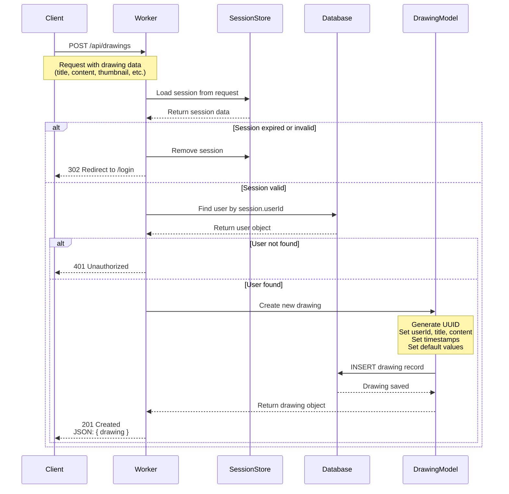
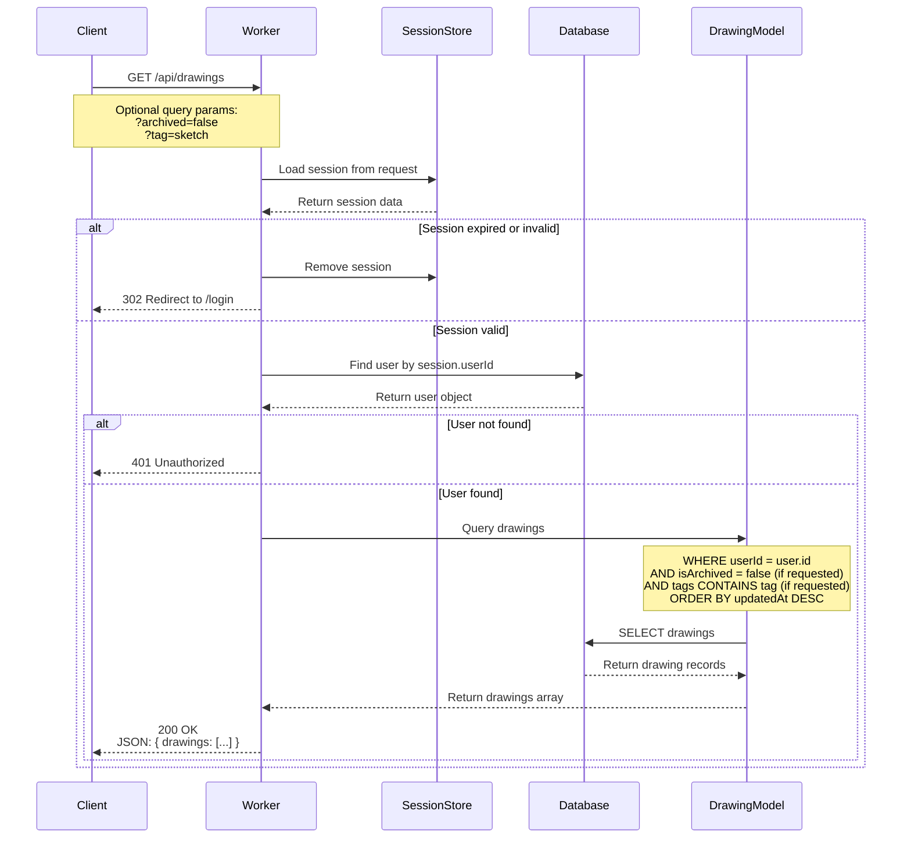
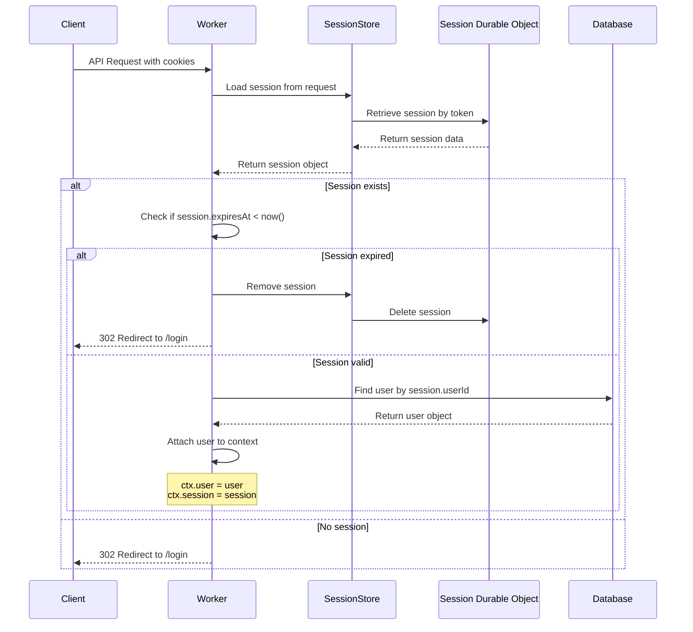

# Drawing API Backend Logic Documentation

This document outlines the backend logic for the drawing management APIs in the Excalidraw Redwood App.

## Overview

The application manages two core drawing operations:
1. **Create Personal Drawing** - Creating and saving new drawings
2. **List Drawings** - Retrieving all drawings for a user

---

## 1. Create Personal Drawing API

### Purpose
Allows authenticated users to create and save new Excalidraw drawings to the database.

### Sequence Diagram



### Expected Request
```typescript
POST /api/drawings
Content-Type: application/json

{
  "title": "My Drawing",
  "description": "Optional description",
  "content": "{...}", // Excalidraw JSON string
  "thumbnail": "data:image/png;base64,...", // Optional
  "isPublic": false,
  "tags": ["sketch", "diagram"]
}
```

### Expected Response
```typescript
201 Created

{
  "drawing": {
    "id": "uuid-here",
    "userId": "user-uuid",
    "title": "My Drawing",
    "description": "Optional description",
    "content": "{...}",
    "thumbnail": "data:image/png;base64,...",
    "isPublic": false,
    "isArchived": false,
    "tags": ["sketch", "diagram"],
    "createdAt": "2025-10-01T10:00:00.000Z",
    "updatedAt": "2025-10-01T10:00:00.000Z",
    "lastOpenedAt": null
  }
}
```

### Drawing Data Model
Based on `src/types/drawing.ts`:
```typescript
interface Drawing {
  id: string              // UUID
  userId: string          // Foreign key to User
  title: string           // Drawing title
  description?: string | null
  content: string         // JSON string of Excalidraw data
  thumbnail?: string | null // Base64 or URL for preview
  isPublic: boolean       // Visibility flag
  isArchived?: boolean    // Archive status
  tags?: string[]         // Optional tags for organization
  createdAt: Date
  updatedAt: Date
  lastOpenedAt?: Date | null
}
```

---

## 2. List Drawings API

### Purpose
Retrieves all drawings belonging to the authenticated user.

### Sequence Diagram



### Expected Request
```typescript
GET /api/drawings
// or with filters
GET /api/drawings?archived=false&tag=sketch
```

### Expected Response
```typescript
200 OK

{
  "drawings": [
    {
      "id": "uuid-1",
      "userId": "user-uuid",
      "title": "Drawing 1",
      "description": null,
      "content": "{...}",
      "thumbnail": "data:image/png;base64,...",
      "isPublic": false,
      "isArchived": false,
      "tags": ["sketch"],
      "createdAt": "2025-10-01T09:00:00.000Z",
      "updatedAt": "2025-10-01T09:30:00.000Z",
      "lastOpenedAt": "2025-10-01T09:30:00.000Z"
    },
    {
      "id": "uuid-2",
      "userId": "user-uuid",
      "title": "Drawing 2",
      "description": "My second drawing",
      "content": "{...}",
      "thumbnail": null,
      "isPublic": true,
      "isArchived": false,
      "tags": ["diagram", "sketch"],
      "createdAt": "2025-09-30T15:00:00.000Z",
      "updatedAt": "2025-10-01T08:00:00.000Z",
      "lastOpenedAt": null
    }
  ],
  "total": 2
}
```

---

## Common Authentication Flow

Both APIs share the same authentication mechanism:



---

## Database Schema (Future Implementation)

**Note:** The Drawing table is not yet implemented in the Prisma schema. The expected schema would be:

```prisma
model Drawing {
  id           String    @id @default(uuid())
  userId       String
  user         User      @relation(fields: [userId], references: [id])
  title        String
  description  String?
  content      String    // JSON string
  thumbnail    String?
  isPublic     Boolean   @default(false)
  isArchived   Boolean   @default(false)
  tags         String[]  // SQLite stores as comma-separated or JSON
  createdAt    DateTime  @default(now())
  updatedAt    DateTime  @updatedAt
  lastOpenedAt DateTime?

  @@index([userId])
  @@index([isArchived])
  @@index([isPublic])
}

// Add to User model:
model User {
  // ... existing fields
  drawings Drawing[]
}
```

---

## Error Handling

### Common Error Responses

| Status Code | Scenario | Response |
|-------------|----------|----------|
| 302 | Session expired or invalid | Redirect to `/login` |
| 401 | Unauthorized (no valid user) | `{ "error": "Unauthorized" }` |
| 400 | Invalid request data | `{ "error": "Invalid request", "details": "..." }` |
| 404 | Drawing not found (for individual ops) | `{ "error": "Drawing not found" }` |
| 500 | Internal server error | `{ "error": "Internal server error" }` |

---

## Implementation Status

- ✅ TypeScript interfaces defined (`src/types/drawing.ts`)
- ✅ UI component ready (`src/app/components/drawing/DrawingCard.tsx`)
- ❌ Database schema not yet added to Prisma
- ❌ API routes not yet implemented
- ❌ Backend functions not yet created

## Next Steps

1. Add `Drawing` model to `prisma/schema.prisma`
2. Run migration: `npx prisma migrate dev --name add_drawing_model`
3. Create `src/app/pages/drawing/functions.ts` with CRUD operations
4. Create `src/app/pages/drawing/routes.ts` with API endpoints
5. Update `src/worker.tsx` to include drawing routes
6. Create UI pages for drawing management
7. Integrate with Excalidraw library

---

**Document Version:** 1.0
**Last Updated:** 2025-10-01
**Author:** Claude Code
