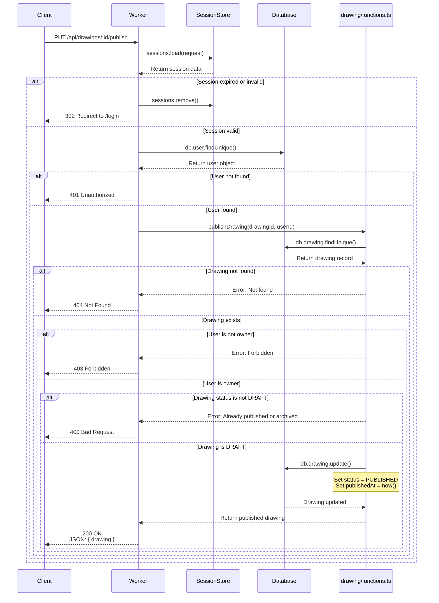
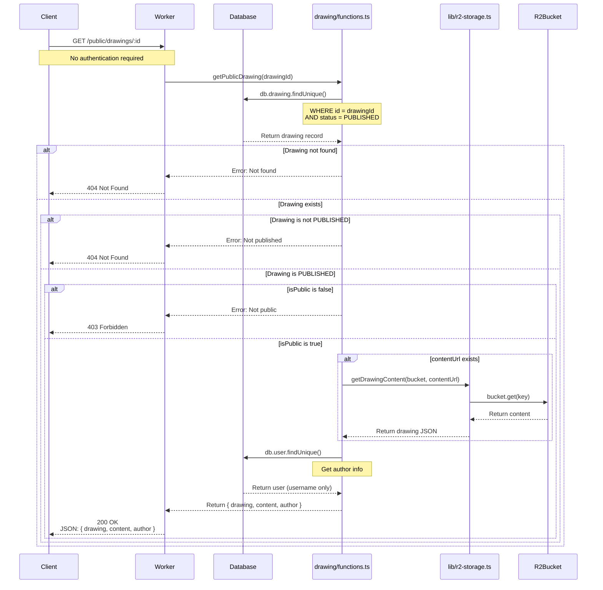
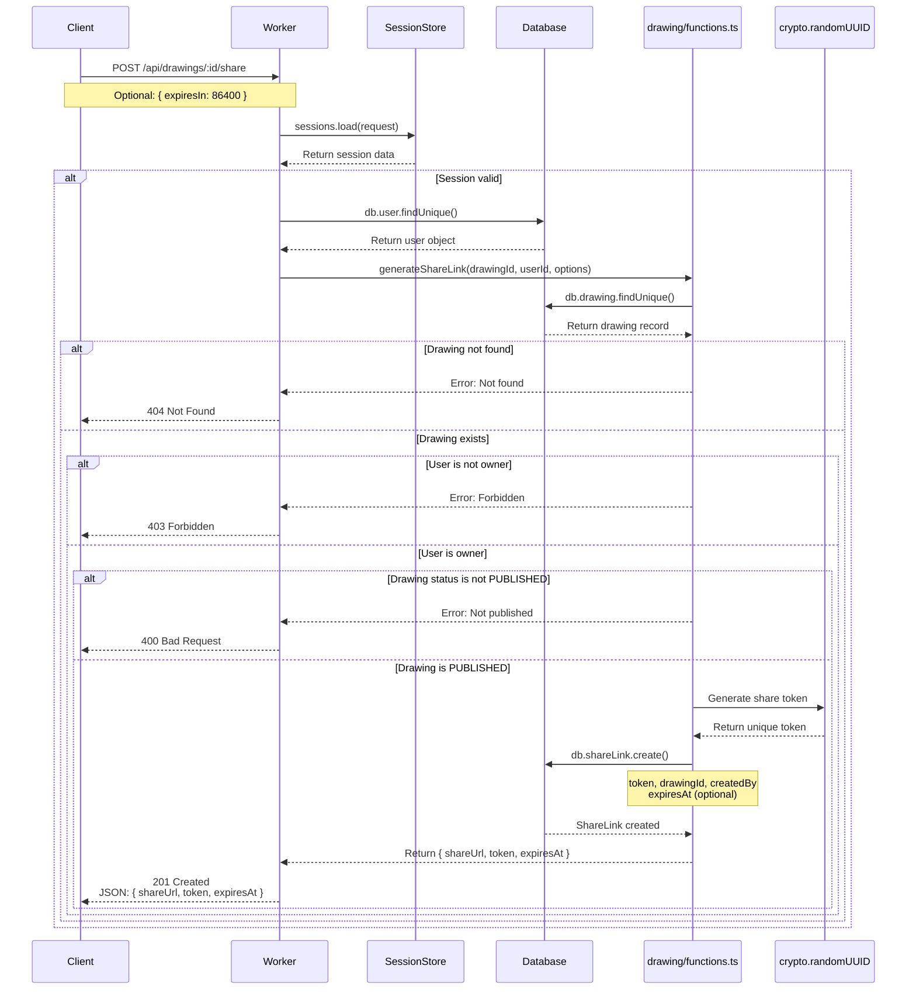
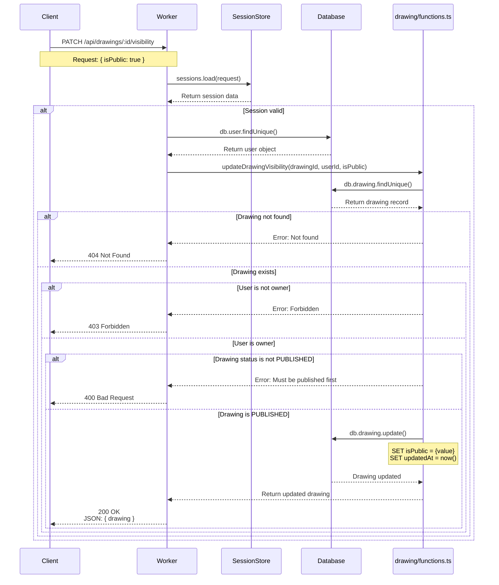
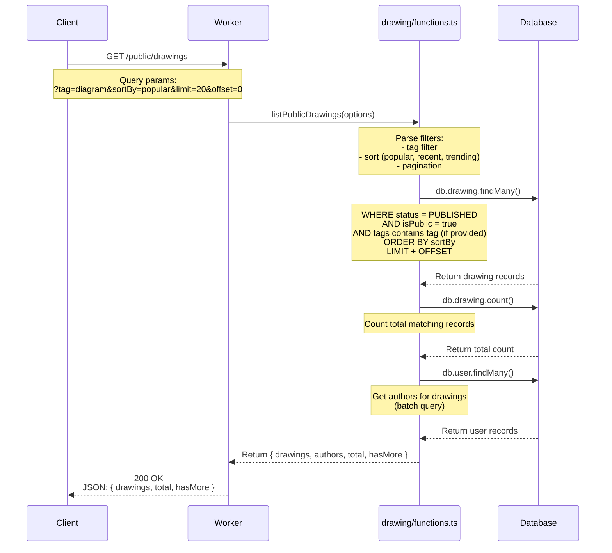
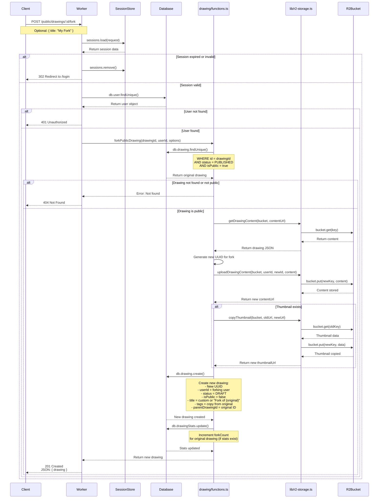

# Published/Shareable Drawing API Documentation

This document outlines the backend APIs for publishing drawings and enabling public sharing/discovery in the Excalidraw Redwood App.

## Overview

Published drawings extend the private DRAFT workflow by enabling public sharing, discovery, and collaboration. This document covers **Phase 1 & 2** implementation:

### Publishing Workflow States

```
DRAFT (Private)
  ↓ User publishes
PUBLISHED (Shareable)
  ├─ isPublic: false → Private shareable (link-only access)
  └─ isPublic: true  → Public shareable (community gallery)
```

### Phase 1 - Essential Sharing (MVP)

1. **Publish Drawing** - Convert DRAFT to PUBLISHED status
2. **Get Public Drawing** - View published drawings without authentication
3. **Generate Share Link** - Create shareable URL/token
4. **Update Public Visibility** - Toggle public/private for published drawings

### Phase 2 - Discovery & Copying

5. **List Public Drawings** - Browse community gallery
6. **Fork Public Drawing** - Copy to personal workspace

---

## Phase 1: Essential Sharing APIs

---

## 1. Publish Drawing API

### Purpose
Converts a DRAFT drawing to PUBLISHED status, making it ready for sharing. Sets the `publishedAt` timestamp and enables sharing features.

### Sequence Diagram



### Expected Request
```typescript
PUT /api/drawings/:id/publish
```

### Expected Response
```typescript
200 OK

{
  "drawing": {
    "id": "uuid-here",
    "userId": "user-uuid",
    "title": "My Published Drawing",
    "description": "Now ready for sharing",
    "contentUrl": "drawing-content/user-uuid/uuid-here.json",
    "thumbnailUrl": "drawing-thumbnails/user-uuid/uuid-here.png",
    "status": "PUBLISHED",
    "isPublic": false,  // Defaults to false (link-only access)
    "tags": ["sketch", "diagram"],
    "publishedAt": "2025-10-02T10:00:00.000Z",  // NEW: Set on publish
    "createdAt": "2025-10-01T10:00:00.000Z",
    "updatedAt": "2025-10-02T10:00:00.000Z",
    "lastOpenedAt": "2025-10-01T15:30:00.000Z"
  }
}
```

### Error Responses

| Status | Scenario | Response |
|--------|----------|----------|
| 400 | Drawing already published/archived | `{ "error": "Drawing is already published or archived" }` |
| 403 | User is not the owner | `{ "error": "Forbidden: You are not the owner of this drawing" }` |
| 404 | Drawing not found | `{ "error": "Drawing not found" }` |

### Notes
- Only DRAFT drawings can be published
- Sets `publishedAt` timestamp to current time
- Defaults to `isPublic: false` (requires share link to access)
- Use "Update Public Visibility" API to make publicly discoverable

---

## 2. Get Public Drawing API

### Purpose
Allows anyone to view a published drawing without authentication. Used for sharing drawings via link or browsing the public gallery.

### Sequence Diagram



### Expected Request
```typescript
GET /public/drawings/:id
```

### Expected Response
```typescript
200 OK

{
  "drawing": {
    "id": "uuid-here",
    "title": "My Published Drawing",
    "description": "A beautiful diagram",
    "thumbnailUrl": "drawing-thumbnails/user-uuid/uuid-here.png",
    "status": "PUBLISHED",
    "isPublic": true,
    "tags": ["sketch", "diagram"],
    "publishedAt": "2025-10-02T10:00:00.000Z",
    "createdAt": "2025-10-01T10:00:00.000Z",
    "updatedAt": "2025-10-02T10:00:00.000Z"
  },
  "content": {
    // Full Excalidraw JSON
    "type": "excalidraw",
    "version": 2,
    "elements": [...],
    "appState": {...}
  },
  "author": {
    "username": "john_doe"
    // NOTE: userId is NOT exposed for privacy
  }
}
```

### Error Responses

| Status | Scenario | Response |
|--------|----------|----------|
| 403 | Drawing is PUBLISHED but isPublic=false | `{ "error": "This drawing is not public" }` |
| 404 | Drawing not found or not PUBLISHED | `{ "error": "Drawing not found" }` |

### Notes
- **No authentication required** - Fully public access
- Only returns drawings with `status = PUBLISHED` AND `isPublic = true`
- For `isPublic = false` drawings, use share link access (API #3)
- Author's userId is hidden for privacy (only username shown)
- R2 content is loaded and returned inline for immediate viewing

---

## 3. Generate Share Link API

### Purpose
Creates a shareable URL with an optional access token for published drawings. Enables link-only access to non-public drawings (`isPublic = false`).

### Sequence Diagram



### Expected Request
```typescript
POST /api/drawings/:id/share
Content-Type: application/json

{
  "expiresIn": 86400  // Optional: seconds until expiration (default: null = never expires)
}
```

### Expected Response
```typescript
201 Created

{
  "shareUrl": "https://app.example.com/share/abc123xyz789",
  "token": "abc123xyz789",
  "expiresAt": "2025-10-03T10:00:00.000Z"  // null if no expiration
}
```

### Database Schema Addition

```prisma
model ShareLink {
  id         String    @id @default(uuid())
  drawingId  String
  drawing    Drawing   @relation(fields: [drawingId], references: [id], onDelete: Cascade)
  token      String    @unique  // Short token for URL (e.g., "abc123xyz789")
  createdBy  String    // userId who created the link
  createdAt  DateTime  @default(now())
  expiresAt  DateTime? // Optional expiration

  @@index([token])
  @@index([drawingId])
}

// Add to Drawing model:
model Drawing {
  // ... existing fields
  shareLinks ShareLink[]
}
```

### Notes
- Only PUBLISHED drawings can have share links
- Token is a short, URL-safe string (8-12 characters)
- Share links work even when `isPublic = false`
- Multiple share links can be created per drawing (e.g., different expiration times)
- Expired links return 404 when accessed

### Access Flow with Share Link

```typescript
// User visits: https://app.example.com/share/abc123xyz789
GET /share/:token

// Backend:
1. Look up ShareLink by token
2. Check if expired
3. Return drawing if valid (even if isPublic = false)
```

---

## 4. Update Public Visibility API

### Purpose
Toggle the `isPublic` flag for a PUBLISHED drawing. Controls whether the drawing appears in public gallery and is accessible without a share link.

### Sequence Diagram



### Expected Request
```typescript
PATCH /api/drawings/:id/visibility
Content-Type: application/json

{
  "isPublic": true  // or false
}
```

### Expected Response
```typescript
200 OK

{
  "drawing": {
    "id": "uuid-here",
    "userId": "user-uuid",
    "title": "My Published Drawing",
    "description": "Now public!",
    "contentUrl": "drawing-content/user-uuid/uuid-here.json",
    "thumbnailUrl": "drawing-thumbnails/user-uuid/uuid-here.png",
    "status": "PUBLISHED",
    "isPublic": true,  // UPDATED
    "tags": ["sketch", "diagram"],
    "publishedAt": "2025-10-02T10:00:00.000Z",
    "createdAt": "2025-10-01T10:00:00.000Z",
    "updatedAt": "2025-10-02T11:00:00.000Z",  // Updated timestamp
    "lastOpenedAt": null
  }
}
```

### Error Responses

| Status | Scenario | Response |
|--------|----------|----------|
| 400 | Drawing is not PUBLISHED | `{ "error": "Drawing must be published before changing visibility" }` |
| 403 | User is not the owner | `{ "error": "Forbidden: You are not the owner of this drawing" }` |
| 404 | Drawing not found | `{ "error": "Drawing not found" }` |

### Notes
- Only works on PUBLISHED drawings (not DRAFT or ARCHIVED)
- `isPublic: true` - Drawing appears in public gallery, accessible to all
- `isPublic: false` - Drawing accessible only via share links
- Does not change `publishedAt` timestamp

### Visibility Comparison Table

| isPublic | Access via /public/drawings/:id | Access via /share/:token | Appears in Gallery |
|----------|--------------------------------|--------------------------|-------------------|
| `true`   | ✅ Yes                         | ✅ Yes                   | ✅ Yes            |
| `false`  | ❌ No (403 Forbidden)          | ✅ Yes (if valid token)  | ❌ No             |

---

## Phase 2: Discovery & Copying APIs

---

## 5. List Public Drawings API

### Purpose
Browse all publicly available drawings in the community gallery. Supports filtering by tags and sorting options.

### Sequence Diagram



### Expected Request
```typescript
GET /public/drawings
// or with filters:
GET /public/drawings?tag=diagram&sortBy=recent&limit=20&offset=0
```

### Query Parameters

| Parameter | Type   | Default  | Description |
|-----------|--------|----------|-------------|
| `tag`     | string | null     | Filter by tag (case-insensitive) |
| `sortBy`  | enum   | 'recent' | Sort order: 'recent', 'popular', 'trending' |
| `limit`   | number | 20       | Number of results (max 100) |
| `offset`  | number | 0        | Pagination offset |

### Expected Response
```typescript
200 OK

{
  "drawings": [
    {
      "id": "uuid-1",
      "title": "System Architecture Diagram",
      "description": "Microservices architecture",
      "thumbnailUrl": "drawing-thumbnails/user-uuid-1/uuid-1.png",
      "status": "PUBLISHED",
      "isPublic": true,
      "tags": ["architecture", "diagram"],
      "publishedAt": "2025-10-02T10:00:00.000Z",
      "createdAt": "2025-10-01T10:00:00.000Z",
      "updatedAt": "2025-10-02T10:00:00.000Z",
      "author": {
        "username": "john_doe"
      }
    },
    {
      "id": "uuid-2",
      "title": "Wireframe Design",
      "description": null,
      "thumbnailUrl": "drawing-thumbnails/user-uuid-2/uuid-2.png",
      "status": "PUBLISHED",
      "isPublic": true,
      "tags": ["wireframe", "ui"],
      "publishedAt": "2025-10-01T14:00:00.000Z",
      "createdAt": "2025-10-01T12:00:00.000Z",
      "updatedAt": "2025-10-01T14:00:00.000Z",
      "author": {
        "username": "jane_smith"
      }
    }
  ],
  "total": 142,
  "hasMore": true
}
```

### Sorting Options

| sortBy      | Order By Logic |
|-------------|----------------|
| `recent`    | `publishedAt DESC` (most recently published first) |
| `popular`   | `viewCount DESC, publishedAt DESC` (requires DrawingStats) |
| `trending`  | `(viewCount / daysSincePublished) DESC` (requires DrawingStats) |

### Notes
- **No authentication required** - Public endpoint
- Only returns drawings with `status = PUBLISHED` AND `isPublic = true`
- Content URLs are NOT included (only metadata and thumbnails)
- Use "Get Public Drawing" API to load full content
- Author userId is hidden for privacy (only username shown)
- Implement caching (e.g., 5 minutes) for performance

### Future Enhancement: Drawing Stats

For `popular` and `trending` sort options, add a `DrawingStats` table:

```prisma
model DrawingStats {
  id        String   @id @default(uuid())
  drawingId String   @unique
  drawing   Drawing  @relation(fields: [drawingId], references: [id], onDelete: Cascade)
  viewCount Int      @default(0)
  forkCount Int      @default(0)
  likeCount Int      @default(0)
  updatedAt DateTime @updatedAt

  @@index([viewCount])
  @@index([forkCount])
}
```

---

## 6. Fork Public Drawing API

### Purpose
Create a copy of a public drawing in the user's workspace. The forked drawing starts as a DRAFT for private editing.

### Sequence Diagram



### Expected Request
```typescript
POST /public/drawings/:id/fork
Content-Type: application/json

{
  "title": "My Fork of Architecture Diagram"  // Optional: defaults to "Fork of {original}"
}
```

### Expected Response
```typescript
201 Created

{
  "drawing": {
    "id": "new-uuid-here",  // NEW UUID
    "userId": "forking-user-uuid",  // Forking user
    "title": "My Fork of Architecture Diagram",
    "description": "Microservices architecture",  // Copied from original
    "contentUrl": "drawing-content/forking-user-uuid/new-uuid-here.json",
    "thumbnailUrl": "drawing-thumbnails/forking-user-uuid/new-uuid-here.png",
    "status": "DRAFT",  // Starts as DRAFT
    "isPublic": false,  // Private by default
    "tags": ["architecture", "diagram"],  // Copied from original
    "parentDrawingId": "original-uuid-here",  // Reference to original
    "publishedAt": null,  // Not published yet
    "createdAt": "2025-10-02T12:00:00.000Z",  // Fork creation time
    "updatedAt": "2025-10-02T12:00:00.000Z",
    "lastOpenedAt": null
  },
  "original": {
    "id": "original-uuid-here",
    "title": "System Architecture Diagram",
    "author": {
      "username": "john_doe"
    }
  }
}
```

### Database Schema Addition

```prisma
model Drawing {
  // ... existing fields

  // Add parent reference for forks
  parentDrawingId String?   // Reference to original drawing (if forked)
  parentDrawing   Drawing?  @relation("DrawingForks", fields: [parentDrawingId], references: [id])
  forks           Drawing[] @relation("DrawingForks")

  @@index([parentDrawingId])
}
```

### Error Responses

| Status | Scenario | Response |
|--------|----------|----------|
| 401 | User not authenticated | `{ "error": "Authentication required to fork drawings" }` |
| 404 | Drawing not found or not public | `{ "error": "Drawing not found or not public" }` |

### Notes
- **Requires authentication** - User must be logged in to fork
- Only PUBLIC drawings (`isPublic = true`) can be forked
- Forked drawing starts as DRAFT (private to forking user)
- Full content is copied to R2 under forking user's namespace
- Thumbnail is also copied (if exists)
- `parentDrawingId` tracks fork lineage
- Original drawing's `forkCount` is incremented (via DrawingStats)
- User can edit, publish, or delete the fork independently

### Fork Chain Example

```
Original Drawing (by john_doe)
  ├─ Fork 1 (by jane_smith) → DRAFT → PUBLISHED
  │   └─ Fork 1.1 (by bob_wilson) → DRAFT
  └─ Fork 2 (by alice_jones) → DRAFT
```

---

## API Summary Table

| Phase | Method | Endpoint | Purpose | Auth Required | Status Impact |
|-------|--------|----------|---------|---------------|---------------|
| 1 | PUT | `/api/drawings/:id/publish` | Publish drawing | ✓ | DRAFT → PUBLISHED |
| 1 | GET | `/public/drawings/:id` | View public drawing | ✗ | Read-only |
| 1 | POST | `/api/drawings/:id/share` | Generate share link | ✓ | No change |
| 1 | PATCH | `/api/drawings/:id/visibility` | Toggle public/private | ✓ | No change |
| 2 | GET | `/public/drawings` | Browse gallery | ✗ | Read-only |
| 2 | POST | `/public/drawings/:id/fork` | Copy to workspace | ✓ | Creates DRAFT |

---

## Database Schema Summary

### New Tables

**ShareLink** - Share tokens for published drawings
```prisma
model ShareLink {
  id         String    @id @default(uuid())
  drawingId  String
  drawing    Drawing   @relation(fields: [drawingId], references: [id], onDelete: Cascade)
  token      String    @unique
  createdBy  String
  createdAt  DateTime  @default(now())
  expiresAt  DateTime?

  @@index([token])
  @@index([drawingId])
}
```

**DrawingStats** (Optional - for popular/trending sorting)
```prisma
model DrawingStats {
  id        String   @id @default(uuid())
  drawingId String   @unique
  drawing   Drawing  @relation(fields: [drawingId], references: [id], onDelete: Cascade)
  viewCount Int      @default(0)
  forkCount Int      @default(0)
  likeCount Int      @default(0)
  updatedAt DateTime @updatedAt

  @@index([viewCount])
  @@index([forkCount])
}
```

### Drawing Model Updates

```prisma
model Drawing {
  // ... existing fields from DRAWING_API_DOCUMENTATION.md

  // NEW: Fork tracking
  parentDrawingId String?   @index
  parentDrawing   Drawing?  @relation("DrawingForks", fields: [parentDrawingId], references: [id])
  forks           Drawing[] @relation("DrawingForks")

  // NEW: Relations
  shareLinks      ShareLink[]
  stats           DrawingStats?
}
```

---

## Common Error Responses

| Status Code | Scenario | Response |
|-------------|----------|----------|
| 400 | Invalid request or status | `{ "error": "Bad Request", "details": "..." }` |
| 401 | Authentication required | `{ "error": "Unauthorized" }` |
| 403 | Not owner or not public | `{ "error": "Forbidden", "details": "..." }` |
| 404 | Drawing not found | `{ "error": "Drawing not found" }` |
| 500 | Internal server error | `{ "error": "Internal server error" }` |

---

## Implementation Checklist

### Phase 1 - Essential Sharing

- [ ] Update `Drawing` model in `prisma/schema.prisma`
  - [ ] Verify `status`, `isPublic`, `publishedAt` fields exist
- [ ] Create `ShareLink` model
- [ ] Implement `drawing/functions.ts`:
  - [ ] `publishDrawing(drawingId, userId)` - Set status to PUBLISHED
  - [ ] `getPublicDrawing(drawingId)` - Get public drawing with content
  - [ ] `generateShareLink(drawingId, userId, options)` - Create share token
  - [ ] `updateDrawingVisibility(drawingId, userId, isPublic)` - Toggle visibility
- [ ] Create API routes in `drawing/routes.ts`:
  - [ ] `PUT /api/drawings/:id/publish`
  - [ ] `GET /public/drawings/:id`
  - [ ] `POST /api/drawings/:id/share`
  - [ ] `PATCH /api/drawings/:id/visibility`
- [ ] Create share link access route:
  - [ ] `GET /share/:token` - Redirect to drawing or render view
- [ ] Update `worker.tsx` to register new routes

### Phase 2 - Discovery & Copying

- [ ] Create `DrawingStats` model (optional, for sorting)
- [ ] Update `Drawing` model for fork tracking (`parentDrawingId`)
- [ ] Implement `drawing/functions.ts`:
  - [ ] `listPublicDrawings(options)` - Browse gallery with filters
  - [ ] `forkPublicDrawing(drawingId, userId, options)` - Copy drawing
- [ ] Create API routes:
  - [ ] `GET /public/drawings`
  - [ ] `POST /public/drawings/:id/fork`
- [ ] Implement sorting logic (recent, popular, trending)
- [ ] Add R2 copy utilities for forking

### Testing

- [ ] Test publish workflow (DRAFT → PUBLISHED)
- [ ] Test public access without authentication
- [ ] Test share link generation and expiration
- [ ] Test visibility toggle (public ↔ private)
- [ ] Test gallery listing with filters
- [ ] Test forking with R2 content copy
- [ ] Test error handling (non-owner, not published, etc.)
- [ ] Test fork chain tracking

---

## Next Steps: Real-Time Collaboration

The **real-time collaboration APIs** (cursor tracking, CRDT-based editing, WebSocket connections) will be documented separately in:

- `REALTIME_COLLABORATION_API.md`

This will cover:
- WebSocket connection management
- Cursor position broadcasting
- CRDT-based conflict resolution (as mentioned in PROJECT_OVERVIEW.md line 303)
- Drawing delta synchronization
- User presence indicators
- Durable Object session management

---

**Document Version:** 1.0
**Last Updated:** 2025-10-02
**Author:** Claude Code
