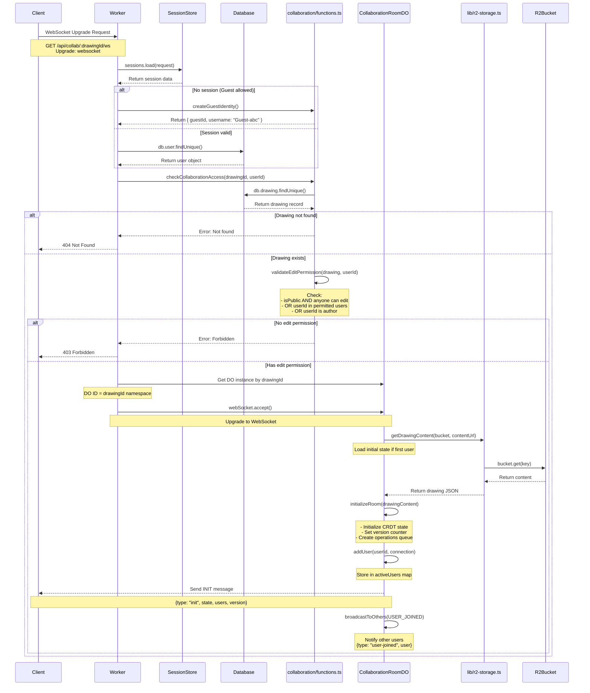
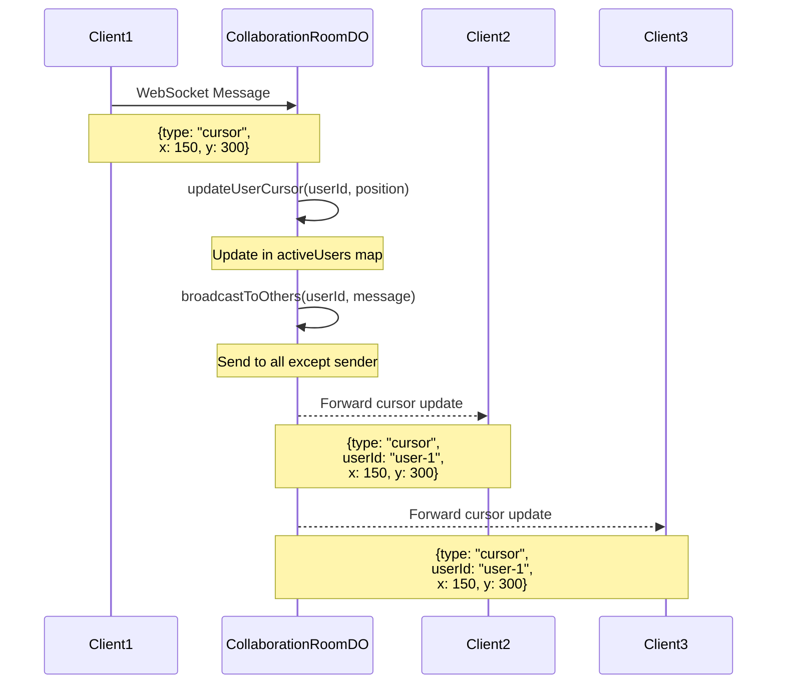
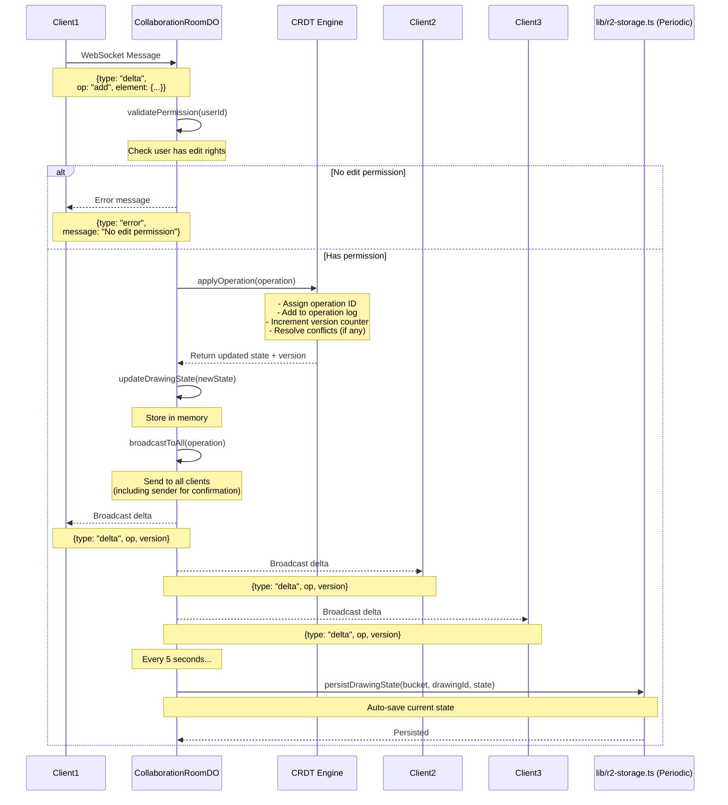
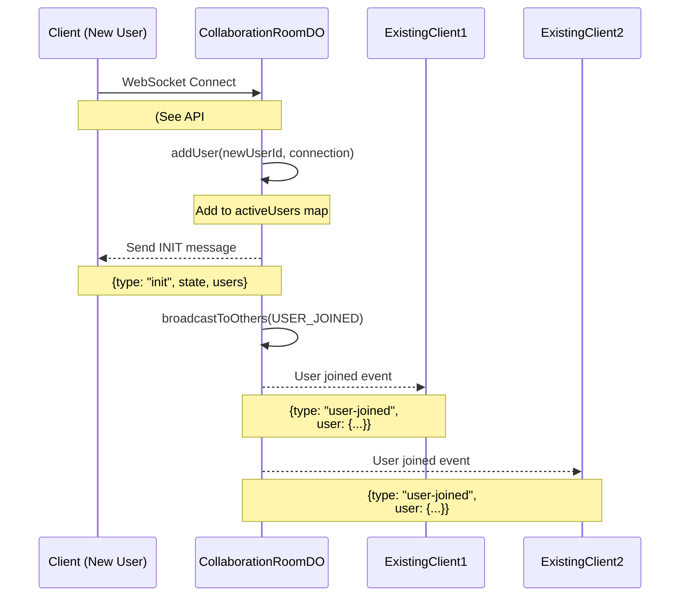
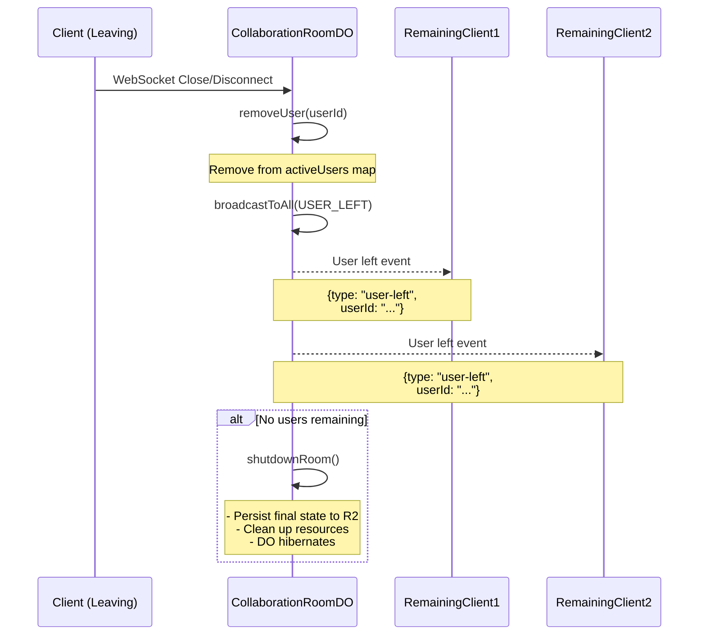
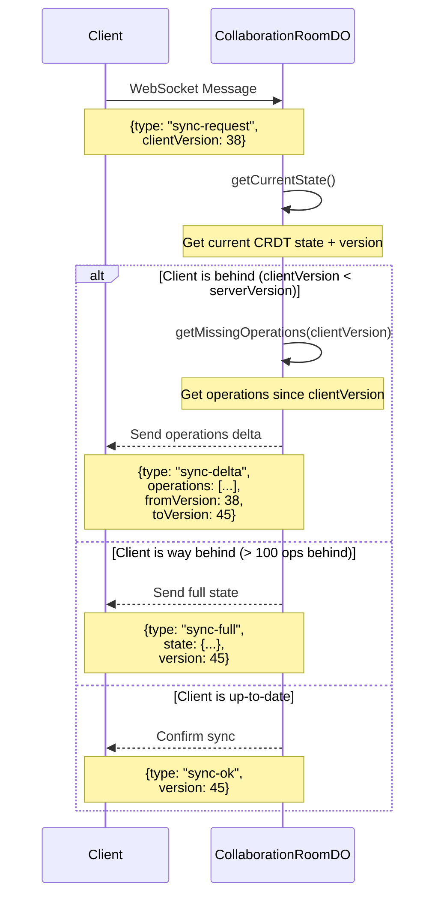
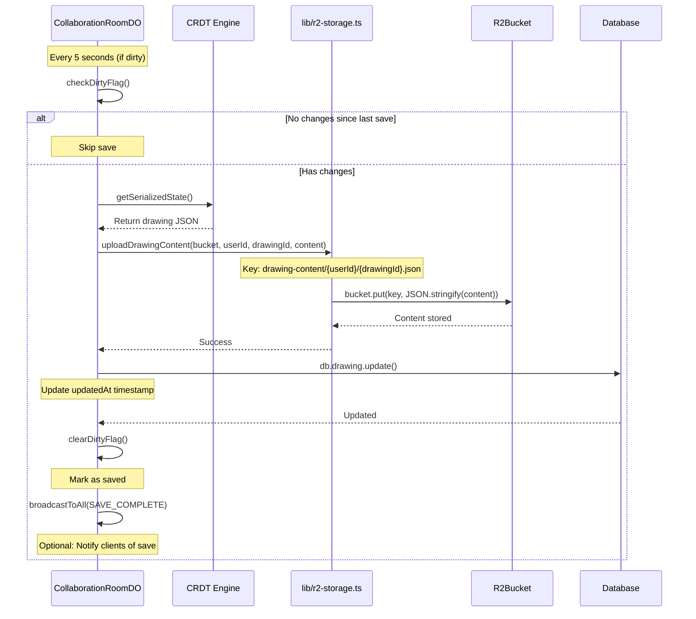

# Real-Time Collaboration API Documentation

This document outlines the WebSocket-based real-time collaboration APIs for the Excalidraw Redwood App, enabling multiple users to draw simultaneously with live cursors, presence indicators, and CRDT-based conflict resolution.

## Overview

Real-time collaboration uses **Cloudflare Durable Objects** as collaborative rooms with WebSocket connections for low-latency communication. The system supports:

- **Live cursor tracking** - See where other users are drawing
- **User presence indicators** - Know who's in the room
- **CRDT-based state management** - Conflict-free concurrent editing
- **Drawing delta synchronization** - Efficient updates (not full document)
- **Periodic persistence** - Auto-save to R2 every 5 seconds
- **Smart resource allocation** - WebSocket only activates when needed

### Architecture Overview

```
┌────────────────────────────────────────────────┐
│         Durable Object (Room)                  │
│                                                │
│  ┌──────────────────────────────────────────┐ │
│  │         Active Users Map                 │ │
│  │  ┌────────┐ ┌────────┐ ┌────────┐      │ │
│  │  │ User1  │ │ User2  │ │ Guest3 │ ...  │ │
│  │  └────────┘ └────────┘ └────────┘      │ │
│  └──────────────────────────────────────────┘ │
│                                                │
│  ┌──────────────────────────────────────────┐ │
│  │          Drawing State (CRDT)            │ │
│  │   - Current drawing data                 │ │
│  │   - Pending operations queue             │ │
│  │   - Version counter                      │ │
│  └──────────────────────────────────────────┘ │
│                                                │
│  ┌──────────────────────────────────────────┐ │
│  │         Broadcast Manager                │ │
│  │   - Cursor positions                     │ │
│  │   - Drawing deltas                       │ │
│  │   - User presence                        │ │
│  └──────────────────────────────────────────┘ │
└────────────────────────────────────────────────┘
                    │
        ┌───────────┼───────────┐
        ▼           ▼           ▼
    WebSocket   WebSocket   WebSocket
    Client 1    Client 2    Client 3
```

### Smart WebSocket Activation

Based on drawing permissions and active users:

| Drawing Type | Active Users | WebSocket Enabled? | Notes |
|--------------|--------------|-------------------|-------|
| DRAFT (Personal) | Any | ❌ No | Local-only, no collaboration |
| PUBLISHED (Read-Only) | Any | ❌ No | Static content delivery |
| PUBLISHED (Author-Only Edit) | 0 | ❌ No | Static delivery |
| PUBLISHED (Author-Only Edit) | Author present | ✅ Yes | Enable for author |
| PUBLISHED (Anyone Can Edit) | 0-1 users | ⚡ Lazy | Prepare room, no broadcast |
| PUBLISHED (Anyone Can Edit) | 2+ users | ✅ Yes | Full collaboration |
| PUBLISHED (Specific Users) | Permitted users | ✅ Yes | Full collaboration |

---

## Core Real-Time APIs

### 1. Connect to Collaboration Room (WebSocket)
### 2. Broadcast Cursor Position
### 3. Broadcast Drawing Delta (CRDT Operation)
### 4. User Join/Leave Events
### 5. Sync Drawing State
### 6. Periodic Auto-Save to R2

---

## 1. Connect to Collaboration Room API

### Purpose
Establish a WebSocket connection to a Durable Object room for real-time collaboration. Validates permissions and initializes user presence.

### Sequence Diagram



### WebSocket Connection Request

```typescript
// Client initiates WebSocket connection
const ws = new WebSocket('wss://app.example.com/api/collab/:drawingId/ws');

// Authentication via cookie (session token)
// OR query param for share token: /ws?token=abc123
```

### Initial Server Message (INIT)

After successful connection, server sends initial state:

```typescript
{
  "type": "init",
  "payload": {
    "drawingId": "uuid-here",
    "version": 42,  // CRDT version counter
    "state": {
      // Current Excalidraw drawing state
      "elements": [...],
      "appState": {...}
    },
    "users": [
      {
        "userId": "user-uuid-1",
        "username": "john_doe",
        "color": "#FF6B6B",  // Assigned cursor color
        "cursor": { "x": 100, "y": 200 }
      },
      {
        "userId": "guest-abc123",
        "username": "Guest-abc",
        "color": "#4ECDC4",
        "cursor": null
      }
    ]
  }
}
```

### Error Responses

| Scenario | Response |
|----------|----------|
| Drawing not found | Close with code 4404 |
| No edit permission | Close with code 4403 |
| Invalid session | Close with code 4401 |

### Notes
- **Durable Object ID = drawingId** - One room per drawing
- Each user gets assigned a unique color for cursor tracking
- Guest users allowed if drawing has "Anyone Can Edit" permission
- Initial state loaded from R2 only if DO has no cached state
- Version counter used for CRDT operation ordering

---

## 2. Broadcast Cursor Position API

### Purpose
Send real-time cursor position updates to other users in the room. Optimized for high-frequency updates (throttled client-side to ~60fps).

### Sequence Diagram



### Client Message Format

```typescript
// Sent by client (throttled to ~16ms intervals)
{
  "type": "cursor",
  "x": 150,
  "y": 300
}
```

### Server Broadcast Format

```typescript
// Forwarded to other clients
{
  "type": "cursor",
  "userId": "user-uuid-1",
  "username": "john_doe",
  "color": "#FF6B6B",
  "x": 150,
  "y": 300,
  "timestamp": 1696252800000
}
```

### Notes
- **High-frequency updates** - Client should throttle to ~60fps (16ms)
- **No persistence** - Cursor positions are ephemeral (not saved to R2)
- **Broadcast only** - Not stored in CRDT state
- Server adds userId and timestamp before forwarding

---

## 3. Broadcast Drawing Delta API (CRDT Operation)

### Purpose
Apply and broadcast drawing changes using CRDT (Conflict-Free Replicated Data Type) for conflict resolution. Ensures all users converge to the same state.

### Sequence Diagram



### Client Message Format (Delta Operation)

```typescript
// Add element
{
  "type": "delta",
  "operation": {
    "op": "add",
    "elementId": "element-uuid-1",
    "element": {
      "type": "rectangle",
      "x": 100,
      "y": 200,
      "width": 150,
      "height": 100,
      "strokeColor": "#000000"
    }
  },
  "clientVersion": 42  // Last known version from client
}

// Update element
{
  "type": "delta",
  "operation": {
    "op": "update",
    "elementId": "element-uuid-1",
    "changes": {
      "x": 120,  // Only changed properties
      "y": 220
    }
  },
  "clientVersion": 43
}

// Delete element
{
  "type": "delta",
  "operation": {
    "op": "delete",
    "elementId": "element-uuid-1"
  },
  "clientVersion": 44
}
```

### Server Broadcast Format

```typescript
{
  "type": "delta",
  "userId": "user-uuid-1",
  "username": "john_doe",
  "operation": {
    "op": "add",
    "elementId": "element-uuid-1",
    "element": { /* ... */ }
  },
  "version": 45,  // New global version after applying operation
  "operationId": "op-12345",  // Unique operation ID for CRDT
  "timestamp": 1696252800000
}
```

### CRDT Conflict Resolution Strategy

The system uses **Last-Write-Wins (LWW) CRDT** with Lamport timestamps:

1. **Operation Ordering**: Each operation gets a unique ID with timestamp
2. **Version Counter**: Global version increments with each operation
3. **Conflict Detection**: If `clientVersion < serverVersion`, client is behind
4. **Resolution**: Server state always wins; client reconciles local state

### Example Conflict Resolution

```
Scenario: Two users update the same element simultaneously

Client 1 (version 42):
  - Update element-1: x = 100

Client 2 (version 42):
  - Update element-1: x = 200

Server receives both:
  1. Client 1's update arrives first → version 43, x = 100
  2. Client 2's update arrives → version 44, x = 200 (overwrites)

Result: All clients converge to x = 200 (last write wins)
```

### Notes
- **CRDT ensures consistency** - No coordination needed between clients
- **Delta-based updates** - Only send changes, not full document
- **Automatic conflict resolution** - No manual intervention required
- **Periodic persistence** - State saved to R2 every 5 seconds
- Clients should handle version mismatches by requesting full state sync

---

## 4. User Join/Leave Events API

### Purpose
Notify all users when someone joins or leaves the collaboration room. Updates presence indicators.

### Sequence Diagram (User Join)



### Sequence Diagram (User Leave)



### User Joined Event

```typescript
{
  "type": "user-joined",
  "user": {
    "userId": "user-uuid-2",
    "username": "jane_smith",
    "color": "#4ECDC4",
    "cursor": null,
    "joinedAt": 1696252800000
  },
  "totalUsers": 3
}
```

### User Left Event

```typescript
{
  "type": "user-left",
  "userId": "user-uuid-2",
  "username": "jane_smith",
  "totalUsers": 2,
  "timestamp": 1696252900000
}
```

### Notes
- **Automatic detection** - WebSocket close triggers user-left event
- **Graceful shutdown** - Last user leaving triggers room hibernation
- **Final persistence** - State saved to R2 before room shuts down
- **Reconnection handling** - Same user rejoining gets same color (if within timeout)

---

## 5. Sync Drawing State API

### Purpose
Request full drawing state from server. Used when client detects version mismatch or recovers from network interruption.

### Sequence Diagram



### Sync Request (Client → Server)

```typescript
{
  "type": "sync-request",
  "clientVersion": 38  // Last known version on client
}
```

### Sync Response Options

**Option 1: Delta Sync (Small gap)**
```typescript
{
  "type": "sync-delta",
  "operations": [
    { "operationId": "op-39", "op": "add", "element": {...} },
    { "operationId": "op-40", "op": "update", "elementId": "...", "changes": {...} },
    // ... up to 100 operations
  ],
  "fromVersion": 38,
  "toVersion": 45
}
```

**Option 2: Full Sync (Large gap or timeout)**
```typescript
{
  "type": "sync-full",
  "state": {
    "elements": [...],  // Full Excalidraw state
    "appState": {...}
  },
  "version": 45,
  "users": [
    { "userId": "...", "username": "...", "color": "...", "cursor": {...} }
  ]
}
```

**Option 3: Already Synced**
```typescript
{
  "type": "sync-ok",
  "version": 45,
  "message": "Client is up-to-date"
}
```

### When to Request Sync

Clients should request sync when:
1. Receiving delta with `version > clientVersion + 1` (missed updates)
2. WebSocket reconnects after network interruption
3. Periodic health check (e.g., every 30 seconds)
4. User manually refreshes drawing

### Notes
- **Delta sync preferred** - More efficient for small gaps (<100 ops)
- **Full sync fallback** - Used when delta too large or operation log pruned
- **Client reconciliation** - Client merges server state with local pending changes

---

## 6. Periodic Auto-Save to R2 API

### Purpose
Automatically persist the current drawing state from Durable Object to R2 storage. Runs every 5 seconds when drawing has changes.

### Sequence Diagram



### Save Notification (Optional)

```typescript
// Sent to all clients after successful save
{
  "type": "save-complete",
  "version": 45,
  "timestamp": 1696252800000,
  "message": "Drawing auto-saved"
}
```

### Auto-Save Configuration

```typescript
// In Durable Object
class CollaborationRoomDO {
  private autoSaveInterval = 5000; // 5 seconds
  private isDirty = false;
  private lastSaveVersion = 0;

  startAutoSave() {
    setInterval(() => {
      if (this.isDirty && this.currentVersion > this.lastSaveVersion) {
        this.persistToR2();
      }
    }, this.autoSaveInterval);
  }

  async persistToR2() {
    const state = this.crdt.getSerializedState();
    await uploadDrawingContent(this.env.DRAWINGS_BUCKET, this.userId, this.drawingId, state);
    await this.updateTimestamp();
    this.isDirty = false;
    this.lastSaveVersion = this.currentVersion;
    this.broadcast({ type: "save-complete", version: this.currentVersion });
  }
}
```

### Notes
- **Dirty flag optimization** - Only save when changes exist
- **Version tracking** - Avoid duplicate saves
- **Async operation** - Doesn't block collaboration
- **Database timestamp** - Updates `updatedAt` for drawing metadata
- **Optional notification** - Clients can show "Saved" indicator

---

## WebSocket Message Type Summary

| Message Type | Direction | Purpose | Frequency |
|--------------|-----------|---------|-----------|
| `init` | Server → Client | Initial state on connect | Once per connection |
| `cursor` | Client ↔ Server | Cursor position updates | ~60fps (throttled) |
| `delta` | Client ↔ Server | Drawing changes (CRDT ops) | On user action |
| `user-joined` | Server → Clients | New user joined room | On connect |
| `user-left` | Server → Clients | User left room | On disconnect |
| `sync-request` | Client → Server | Request state sync | On version mismatch |
| `sync-delta` | Server → Client | Missing operations | Response to sync |
| `sync-full` | Server → Client | Full state snapshot | Response to sync |
| `sync-ok` | Server → Client | Client up-to-date | Response to sync |
| `save-complete` | Server → Clients | Auto-save completed | Every 5 seconds |
| `error` | Server → Client | Operation error | On validation failure |

---

## Durable Object Implementation

### CollaborationRoomDO Structure

```typescript
// src/collaboration/CollaborationRoomDO.ts

import { DurableObject } from "cloudflare:workers";
import { CRDT } from "./crdt";

interface ActiveUser {
  userId: string;
  username: string;
  color: string;
  connection: WebSocket;
  cursor: { x: number; y: number } | null;
  joinedAt: number;
  lastActivity: number;
}

export class CollaborationRoomDO extends DurableObject {
  private drawingId: string;
  private activeUsers: Map<string, ActiveUser>;
  private crdt: CRDT;
  private currentVersion: number;
  private isDirty: boolean;
  private autoSaveTimer: NodeJS.Timeout | null;

  constructor(state: DurableObjectState, env: Env) {
    super(state, env);
    this.activeUsers = new Map();
    this.crdt = new CRDT();
    this.currentVersion = 0;
    this.isDirty = false;
    this.autoSaveTimer = null;
  }

  async fetch(request: Request): Promise<Response> {
    // Handle WebSocket upgrade
    if (request.headers.get("Upgrade") === "websocket") {
      const pair = new WebSocketPair();
      await this.handleWebSocket(pair[1], request);
      return new Response(null, { status: 101, webSocket: pair[0] });
    }

    return new Response("Expected WebSocket", { status: 400 });
  }

  async handleWebSocket(ws: WebSocket, request: Request) {
    // 1. Validate permissions
    // 2. Initialize user
    // 3. Send INIT message
    // 4. Attach message handlers
    // 5. Start auto-save if first user
  }

  async handleMessage(userId: string, message: any) {
    switch (message.type) {
      case "cursor":
        this.handleCursorUpdate(userId, message);
        break;
      case "delta":
        await this.handleDeltaOperation(userId, message);
        break;
      case "sync-request":
        this.handleSyncRequest(userId, message);
        break;
    }
  }

  handleCursorUpdate(userId: string, message: any) {
    const user = this.activeUsers.get(userId);
    if (user) {
      user.cursor = { x: message.x, y: message.y };
      this.broadcastToOthers(userId, {
        type: "cursor",
        userId,
        username: user.username,
        color: user.color,
        x: message.x,
        y: message.y,
        timestamp: Date.now(),
      });
    }
  }

  async handleDeltaOperation(userId: string, message: any) {
    // 1. Validate user has edit permission
    // 2. Apply operation to CRDT
    // 3. Update version
    // 4. Set dirty flag
    // 5. Broadcast to all clients
  }

  broadcastToAll(message: any) {
    for (const user of this.activeUsers.values()) {
      user.connection.send(JSON.stringify(message));
    }
  }

  broadcastToOthers(excludeUserId: string, message: any) {
    for (const [userId, user] of this.activeUsers) {
      if (userId !== excludeUserId) {
        user.connection.send(JSON.stringify(message));
      }
    }
  }

  async persistToR2() {
    // See API #6 implementation
  }
}
```

### CRDT Engine Structure

```typescript
// src/collaboration/crdt.ts

export interface CRDTOperation {
  operationId: string;
  timestamp: number;
  userId: string;
  op: "add" | "update" | "delete";
  elementId: string;
  data?: any;
}

export class CRDT {
  private elements: Map<string, any>;
  private operations: CRDTOperation[];
  private version: number;

  constructor() {
    this.elements = new Map();
    this.operations = [];
    this.version = 0;
  }

  applyOperation(op: CRDTOperation): void {
    this.operations.push(op);
    this.version++;

    switch (op.op) {
      case "add":
        this.elements.set(op.elementId, op.data);
        break;
      case "update":
        const existing = this.elements.get(op.elementId);
        if (existing) {
          this.elements.set(op.elementId, { ...existing, ...op.data });
        }
        break;
      case "delete":
        this.elements.delete(op.elementId);
        break;
    }
  }

  getSerializedState() {
    return {
      type: "excalidraw",
      version: 2,
      elements: Array.from(this.elements.values()),
      appState: { /* ... */ },
    };
  }

  getOperationsSince(version: number): CRDTOperation[] {
    return this.operations.filter((op, idx) => idx >= version);
  }
}
```

---

## Database Schema Additions

### CollaborationSession Table (Optional)

Track active collaboration sessions for analytics:

```prisma
model CollaborationSession {
  id              String    @id @default(uuid())
  drawingId       String
  drawing         Drawing   @relation(fields: [drawingId], references: [id], onDelete: Cascade)
  durableObjectId String    // Durable Object instance ID
  activeUserCount Int       @default(0)
  startedAt       DateTime  @default(now())
  endedAt         DateTime?
  lastActivity    DateTime  @updatedAt

  @@index([drawingId])
  @@index([durableObjectId])
}

// Add to Drawing model:
model Drawing {
  // ... existing fields
  collaborationSessions CollaborationSession[]
}
```

---

## Performance Optimizations

### 1. Message Throttling (Client-Side)

```typescript
// Throttle cursor updates to 60fps
let lastCursorSend = 0;
const CURSOR_THROTTLE = 16; // ms

function sendCursorUpdate(x: number, y: number) {
  const now = Date.now();
  if (now - lastCursorSend >= CURSOR_THROTTLE) {
    ws.send(JSON.stringify({ type: "cursor", x, y }));
    lastCursorSend = now;
  }
}
```

### 2. Operation Batching (Server-Side)

```typescript
// Batch multiple operations into single broadcast
class OperationBatcher {
  private pending: CRDTOperation[] = [];
  private timer: NodeJS.Timeout | null = null;

  add(operation: CRDTOperation) {
    this.pending.push(operation);

    if (!this.timer) {
      this.timer = setTimeout(() => this.flush(), 50); // 50ms batch window
    }
  }

  flush() {
    if (this.pending.length > 0) {
      this.broadcast({ type: "delta-batch", operations: this.pending });
      this.pending = [];
    }
    this.timer = null;
  }
}
```

### 3. CRDT Operation Log Pruning

```typescript
// Keep only last 1000 operations in memory
const MAX_OPERATIONS = 1000;

pruneOperationLog() {
  if (this.operations.length > MAX_OPERATIONS) {
    // Keep recent 1000, persist older ones to R2 version history
    const toArchive = this.operations.slice(0, -MAX_OPERATIONS);
    this.archiveOperations(toArchive);
    this.operations = this.operations.slice(-MAX_OPERATIONS);
  }
}
```

---

## Error Handling

### Client-Side Reconnection Logic

```typescript
class CollaborationClient {
  private ws: WebSocket | null = null;
  private reconnectAttempts = 0;
  private maxReconnectAttempts = 5;

  connect() {
    this.ws = new WebSocket(this.url);

    this.ws.onclose = (event) => {
      if (event.code === 4403) {
        // Permission denied - don't reconnect
        this.handlePermissionDenied();
      } else if (this.reconnectAttempts < this.maxReconnectAttempts) {
        // Network error - attempt reconnect
        this.reconnectAttempts++;
        const delay = Math.min(1000 * Math.pow(2, this.reconnectAttempts), 30000);
        setTimeout(() => this.connect(), delay);
      }
    };

    this.ws.onopen = () => {
      this.reconnectAttempts = 0;
      this.requestSync(); // Get latest state after reconnect
    };
  }

  requestSync() {
    this.send({ type: "sync-request", clientVersion: this.version });
  }
}
```

---

## Security Considerations

### 1. Permission Validation

```typescript
// Validate on every WebSocket message
async validateEditPermission(userId: string, drawingId: string): Promise<boolean> {
  const drawing = await db.drawing.findUnique({ where: { id: drawingId } });

  if (!drawing || drawing.status !== "PUBLISHED") {
    return false;
  }

  // Check permission based on drawing settings
  if (drawing.userId === userId) return true; // Owner
  if (drawing.isPublic && drawing.allowsAnyoneEdit) return true;
  // ... check specific users list

  return false;
}
```

### 2. Rate Limiting

```typescript
// Limit messages per user per second
class RateLimiter {
  private counts: Map<string, number> = new Map();
  private readonly maxPerSecond = 100;

  check(userId: string): boolean {
    const count = this.counts.get(userId) || 0;
    if (count >= this.maxPerSecond) {
      return false; // Rate limited
    }
    this.counts.set(userId, count + 1);

    // Reset every second
    setTimeout(() => this.counts.set(userId, 0), 1000);

    return true;
  }
}
```

### 3. WebSocket Close Codes

| Code | Meaning | Client Action |
|------|---------|---------------|
| 1000 | Normal closure | None |
| 4400 | Bad request | Show error, don't reconnect |
| 4401 | Unauthorized | Redirect to login |
| 4403 | Forbidden | Show permission error, don't reconnect |
| 4404 | Drawing not found | Show error, don't reconnect |
| 1006 | Abnormal closure (network) | Attempt reconnect |

---

## Testing Checklist

- [ ] Test WebSocket connection and initialization
- [ ] Test cursor position broadcasting (multiple users)
- [ ] Test CRDT operations (add, update, delete elements)
- [ ] Test concurrent editing conflict resolution
- [ ] Test user join/leave events
- [ ] Test state sync after network interruption
- [ ] Test periodic auto-save to R2
- [ ] Test permission validation (owner, guest, specific users)
- [ ] Test rate limiting
- [ ] Test graceful shutdown when last user leaves
- [ ] Test reconnection logic
- [ ] Test large drawing performance (1000+ elements)
- [ ] Test high-frequency cursor updates (60fps)
- [ ] Load test: 10+ concurrent users in one room

---

## Implementation Checklist

### Core Infrastructure
- [ ] Create `CollaborationRoomDO` Durable Object class
- [ ] Implement CRDT engine with LWW strategy
- [ ] Add WebSocket upgrade handler in worker
- [ ] Create collaboration routing in `worker.tsx`

### Message Handlers
- [ ] Implement `handleWebSocketConnect()`
- [ ] Implement `handleCursorUpdate()`
- [ ] Implement `handleDeltaOperation()`
- [ ] Implement `handleSyncRequest()`
- [ ] Implement `handleUserJoin()`
- [ ] Implement `handleUserLeave()`

### Persistence
- [ ] Implement periodic auto-save (5 seconds)
- [ ] Add R2 persistence utilities
- [ ] Update D1 timestamp on save
- [ ] Implement operation log archiving

### Client SDK
- [ ] Create WebSocket client wrapper
- [ ] Implement cursor throttling (60fps)
- [ ] Implement delta operation sender
- [ ] Implement sync request logic
- [ ] Implement reconnection handler
- [ ] Add rate limiting

### Security
- [ ] Add permission validation on connect
- [ ] Add permission validation on every operation
- [ ] Implement rate limiting per user
- [ ] Add WebSocket close code handling

### Testing
- [ ] Unit tests for CRDT engine
- [ ] Integration tests for WebSocket handlers
- [ ] E2E tests for multi-user collaboration
- [ ] Load testing for 10+ concurrent users

---

**Document Version:** 1.0
**Last Updated:** 2025-10-02
**Author:** Claude Code
